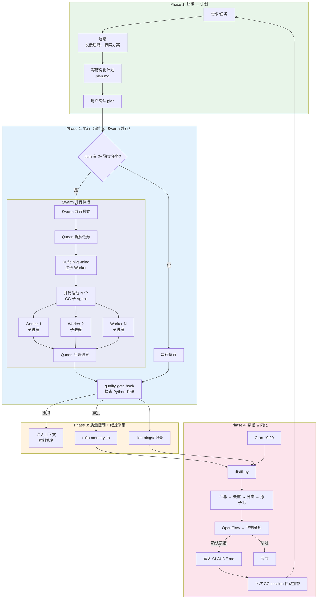
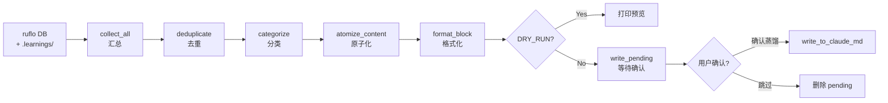
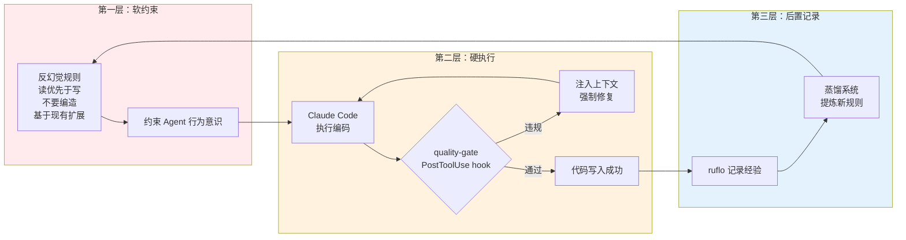
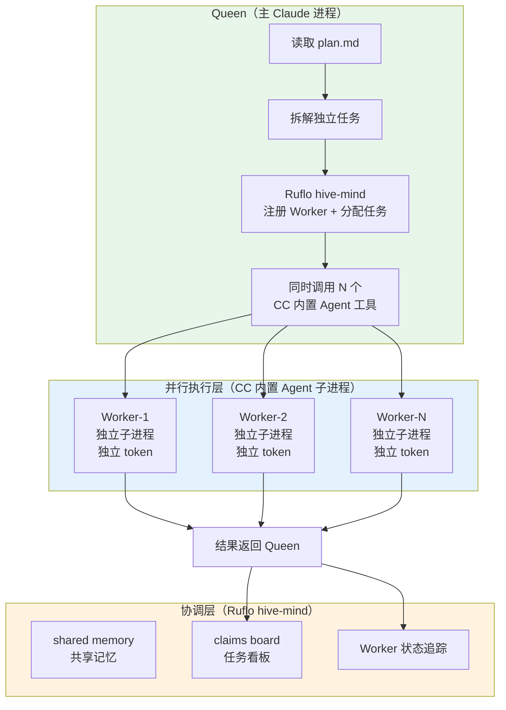
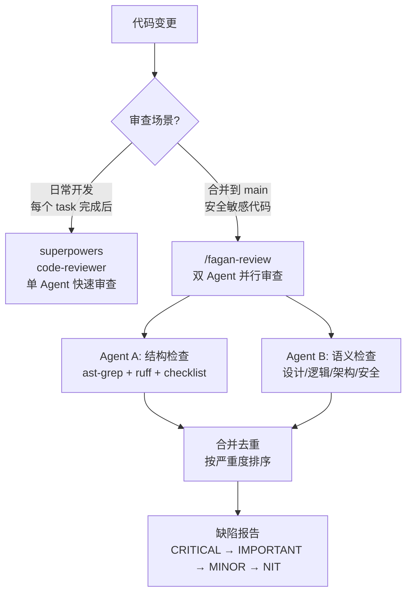

# 工作流流程图

## 完整流程

```mermaid
flowchart TD
    subgraph Phase1["Phase 1: 脑爆 → 计划"]
        A[需求/任务] --> B[脑爆<br/>发散思路、探索方案]
        B --> C[写结构化计划<br/>plan.md]
        C --> D[用户确认 plan]
    end

    subgraph Phase2["Phase 2: 执行（串行 or Swarm 并行）"]
        D --> E{plan 有 2+ 独立任务?}
        E -->|是| SW[Swarm 并行模式]
        E -->|否| SE[串行执行]

        subgraph Swarm["Swarm 并行执行"]
            SW --> SW1[Queen 拆解任务]
            SW1 --> SW2[Ruflo hive-mind<br/>注册 Worker]
            SW2 --> SW3[并行启动 N 个<br/>CC 子 Agent]
            SW3 --> SW4[Worker-1<br/>子进程]
            SW3 --> SW5[Worker-2<br/>子进程]
            SW3 --> SW6[Worker-N<br/>子进程]
            SW4 --> SW7[Queen 汇总结果]
            SW5 --> SW7
            SW6 --> SW7
        end

        SE --> QG
        SW7 --> QG
    end

    subgraph Phase3["Phase 3: 质量控制 + 经验采集"]
        QG[quality-gate hook<br/>检查 Python 代码]
        QG -->|违规| QG2[注入上下文<br/>强制修复]
        QG -->|通过| F[ruflo memory.db]
        QG --> G[.learnings/ 记录]
    end

    subgraph Phase4["Phase 4: 蒸馏 & 内化"]
        I[Cron 19:00] --> J[distill.py]
        F --> J
        G --> J
        J --> K[汇总 → 去重 → 分类 → 原子化]
        K --> O[OpenClaw → 飞书通知]
        O -->|确认蒸馏| P[写入 CLAUDE.md]
        O -->|跳过| Q[丢弃]
        P --> R[下次 CC session 自动加载]
        R --> A
    end

    style Phase1 fill:#e8f5e9
    style Phase2 fill:#e3f2fd
    style Phase3 fill:#fff3e0
    style Phase4 fill:#fce4ec
    style Swarm fill:#e8eaf6
```

## 蒸馏管道

```mermaid
flowchart LR
    A[ruflo DB<br/>+ .learnings/] --> B[collect_all<br/>汇总]
    B --> C[deduplicate<br/>去重]
    C --> D[categorize<br/>分类]
    D --> E[atomize_content<br/>原子化]
    E --> F[format_block<br/>格式化]
    F --> G{DRY_RUN?}
    G -->|Yes| H[打印预览]
    G -->|No| I[write_pending<br/>等待确认]
    I --> J{用户确认?}
    J -->|确认蒸馏| K[write_to_claude_md]
    J -->|跳过| L[删除 pending]
```

## 三层防御体系

```mermaid
flowchart LR
    subgraph Layer1["第一层：软约束"]
        A[反幻觉规则<br/>读优先于写<br/>不要编造<br/>基于现有扩展] --> B[约束 Agent 行为意识]
    end

    subgraph Layer2["第二层：硬执行"]
        B --> C[Claude Code<br/>执行编码]
        C --> D{quality-gate<br/>PostToolUse hook}
        D -->|违规| E[注入上下文<br/>强制修复]
        E --> C
        D -->|通过| F[代码写入成功]
    end

    subgraph Layer3["第三层：后置记录"]
        F --> G[ruflo 记录经验]
        G --> H[蒸馏系统<br/>提炼新规则]
        H --> A
    end

    style Layer1 fill:#ffebee
    style Layer2 fill:#fff3e0
    style Layer3 fill:#e3f2fd
```

## Swarm Agent 架构

```mermaid
flowchart TD
    subgraph Queen["Queen（主 Claude 进程）"]
        Q1[读取 plan.md] --> Q2[拆解独立任务]
        Q2 --> Q3[Ruflo hive-mind<br/>注册 Worker + 分配任务]
        Q3 --> Q4[同时调用 N 个<br/>CC 内置 Agent 工具]
    end

    subgraph Execution["并行执行层（CC 内置 Agent 子进程）"]
        Q4 --> W1[Worker-1<br/>独立子进程<br/>独立 token]
        Q4 --> W2[Worker-2<br/>独立子进程<br/>独立 token]
        Q4 --> W3[Worker-N<br/>独立子进程<br/>独立 token]
    end

    subgraph Coordination["协调层（Ruflo hive-mind）"]
        R1[shared memory<br/>共享记忆]
        R2[claims board<br/>任务看板]
        R3[Worker 状态追踪]
    end

    W1 --> RET[结果返回 Queen]
    W2 --> RET
    W3 --> RET
    RET --> R2
    RET --> R3

    style Queen fill:#e8f5e9
    style Execution fill:#e3f2fd
    style Coordination fill:#fff3e0
```

## 代码审查体系

```mermaid
flowchart TD
    A[代码变更] --> B{审查场景?}
    B -->|日常开发<br/>每个 task 完成后| C[superpowers<br/>code-reviewer<br/>单 Agent 快速审查]
    B -->|合并到 main<br/>安全敏感代码| D["/fagan-review<br/>双 Agent 并行审查"]

    D --> E[Agent A: 结构检查<br/>ast-grep + ruff + checklist]
    D --> F[Agent B: 语义检查<br/>设计/逻辑/架构/安全]
    E --> G[合并去重<br/>按严重度排序]
    F --> G
    G --> H[缺陷报告<br/>CRITICAL → IMPORTANT → MINOR → NIT]
```
