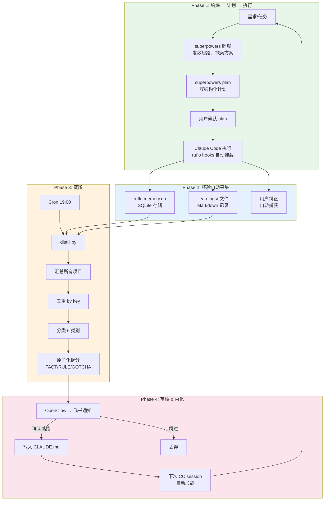
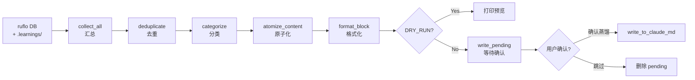
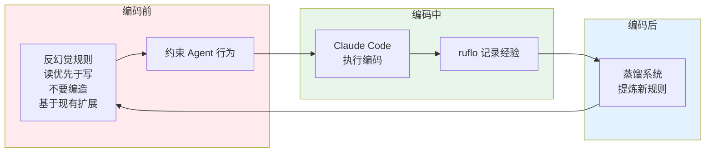

# 工作流流程图

## 完整流程

```mermaid
flowchart TD
    subgraph Phase1["Phase 1: 脑爆 → 计划 → 执行"]
        A[需求/任务] --> B[superpowers 脑爆<br/>发散思路、探索方案]
        B --> C[superpowers plan<br/>写结构化计划]
        C --> D[用户确认 plan]
        D --> E[Claude Code 执行<br/>ruflo hooks 自动挂载]
    end

    subgraph Phase2["Phase 2: 经验自动采集"]
        E --> F[ruflo memory.db<br/>SQLite 存储]
        E --> G[.learnings/ 文件<br/>Markdown 记录]
        E --> H[用户纠正<br/>自动捕获]
    end

    subgraph Phase3["Phase 3: 蒸馏"]
        I[Cron 19:00] --> J[distill.py]
        F --> J
        G --> J
        J --> K[汇总所有项目]
        K --> L[去重 by key]
        L --> M[分类 6 类别]
        M --> N[原子化拆分<br/>FACT/RULE/GOTCHA]
    end

    subgraph Phase4["Phase 4: 审核 & 内化"]
        N --> O[OpenClaw → 飞书通知]
        O -->|确认蒸馏| P[写入 CLAUDE.md]
        O -->|跳过| Q[丢弃]
        P --> R[下次 CC session<br/>自动加载]
        R --> A
    end

    style Phase1 fill:#e8f5e9
    style Phase2 fill:#e3f2fd
    style Phase3 fill:#fff3e0
    style Phase4 fill:#fce4ec
```

## 蒸馏管道

```mermaid
flowchart LR
    A[ruflo DB<br/>+ .learnings/] --> B[collect_all<br/>汇总]
    B --> C[deduplicate<br/>去重]
    C --> D[categorize<br/>分类]
    D --> E[atomize_content<br/>原子化]
    E --> F[format_block<br/>格式化]
    F --> G{DRY_RUN?}
    G -->|Yes| H[打印预览]
    G -->|No| I[write_pending<br/>等待确认]
    I --> J{用户确认?}
    J -->|确认蒸馏| K[write_to_claude_md]
    J -->|跳过| L[删除 pending]
```

## 反幻觉规则 vs ruflo

```mermaid
flowchart LR
    subgraph Before["编码前"]
        A[反幻觉规则<br/>读优先于写<br/>不要编造<br/>基于现有扩展] --> B[约束 Agent 行为]
    end

    subgraph During["编码中"]
        B --> C[Claude Code<br/>执行编码]
        C --> D[ruflo 记录经验]
    end

    subgraph After["编码后"]
        D --> E[蒸馏系统<br/>提炼新规则]
        E --> A
    end

    style Before fill:#ffebee
    style During fill:#e8f5e9
    style After fill:#e3f2fd
```
