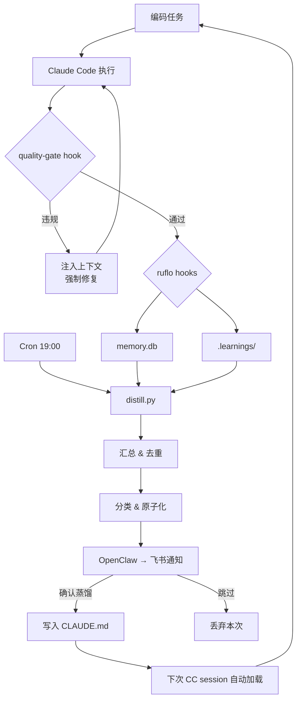

# 经验蒸馏系统设计

## 问题

AI Coding Agent 每次 session 都是全新开始。它不记得：
- 上次在这个项目里踩了什么坑
- 哪些 API 的行为和文档不一致
- 团队的编码约定是什么
- 上次用了什么 workaround

这导致同样的错误反复出现，同样的经验反复重新发现。

## 设计思路

参考人类记忆的三层模型和 PlugMem 论文（arXiv:2603.03296）：

```
Episodic Memory（情景记忆）
    ↓ 蒸馏提炼
Semantic Memory（语义记忆）
    ↓ 内化为规则
Procedural Memory（程序记忆）
```

### 第一层：Episodic — 原始经验采集

**来源 1: ruflo SQLite DB**
```python
# ruflo 的 memory.db 结构
# key: 经验标识符
# content: JSON 或纯文本，包含经验内容
```

**来源 2: .learnings/ Markdown 文件**
```markdown
## [LRN-20260304-001] correction
**Logged**: 2026-03-04 14:30
**Priority**: high
**Area**: backend

### Summary
服务层应该用 flush 不是 commit

### Details
在 FastAPI + SQLAlchemy 项目中，service 层直接调用 commit 会导致事务边界不清晰...
```

### 第二层：Semantic — 蒸馏提炼

`distill.py` 每天运行一次，执行以下步骤：

**1. 汇总**
扫描 `~/coding/` 下所有项目的 `.swarm/memory.db` 和 `.learnings/*.md`

**2. 去重**
基于 key 去重，如果同一个 key 有多条记录，保留内容更丰富的版本。

**3. 分类**
关键词匹配，分到 6 个类别：
- 架构设计
- 算法与数据结构
- Bug 与踩坑
- 性能优化
- 纠正记录
- 其他经验

**4. 原子化**
这是关键步骤。把复合经验拆成独立知识点：

```python
# 输入
"1) 服务层只做 flush 不做 commit；2) 跨模块用 lazy import 避免循环依赖"

# 输出
("FACT", "服务层只做 flush 不做 commit")
("RULE", "跨模块用 lazy import 避免循环依赖")
```

自动打标签的规则：
- 含"必须/应该/需要/不要/禁止" → `RULE` ⚙️
- 含"坑/bug/错误/失败/null" → `GOTCHA` ⚠️
- 其余 → `FACT` 📌

**5. 人工审核**
蒸馏结果不自动写入。通过 OpenClaw → 飞书推送预览，用户回复「确认蒸馏」后才写入。

这个 Human-in-the-Loop 环节防止低质量或错误的经验进入规则库。

### 第三层：Procedural — 行为内化

确认后的经验写入 `~/.claude/CLAUDE.md`。这个文件在每次 CC session 启动时自动加载到 system prompt。

经验从此变成 Agent 的"本能"——不需要主动查询，每次都自动生效。

## 架构图



## 当前局限和演进方向

| 局限 | 计划 |
|------|------|
| 知识是平铺列表，无关联 | 50+ 条后考虑知识图谱组织 |
| 全量加载，不是按需检索 | 等规模增长后引入 RAG 检索 |
| 分类靠关键词，准确率有限 | 后续可用 LLM 做分类 |
| 没有热/冷分层 | 条目多了后按使用频率分层 |
